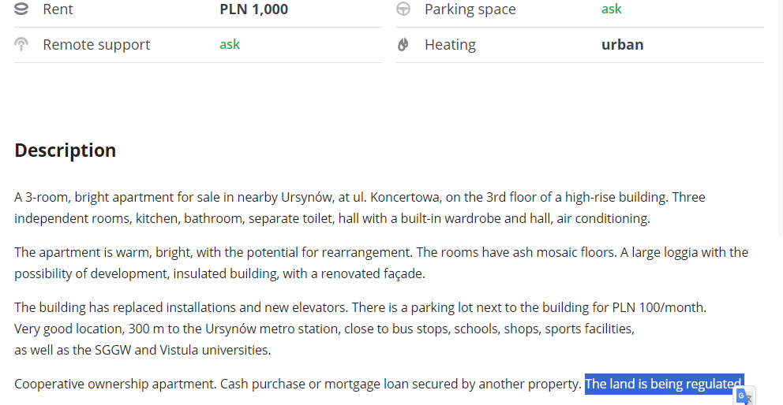

# Otodom scraper and information retrieval

Otodom.pl is a Polish online real estate marketplace. They provide a lot of useful filters (price, size, number of rooms), but I stumbled upon situations where those filters are not enough. Sometimes relevant informations are present only in the description. That is why I created this tool.

This tool does the following:
 - scrapes all offers from a given `listing` link (like [this](https://www.otodom.pl/pl/wyniki/sprzedaz/mieszkanie/mazowieckie/warszawa/warszawa/warszawa/ursynow?priceMax=1000000&areaMin=50&viewType=listing)). The link can and should include built-in otodom filters

 - extracts the offer description and other stuff and saves it into a database 
 
 - Asks GPT (OpenAI) to answer questions from `questions.json` in natural language (using langchain)
 ```Example questions and answers:
Question: Is the land regulated?
Answer: The land is being regulated.

Question: Is a land and mortgage register established?
Answer: No, the description contains information that a land and mortgage register has not been established.

Question: How much is the rent?
Answer: The rent is PLN 1,000.

Question: Is the apartment two-sided?
Answer: Yes, the description includes information that the apartment is two-sided, the windows face two sides of the world: south and north
```
 - Parses the answer from the previous step from natural language to json composed of integers and enums (yes/no/no information)
 ```json

 {
"lands_regulated": "false",
"mortgage_register": "no_information", 
"rent_administration_fee": 1000, 
"two_sided": "true"
}
```
 - Displays the offers back to the user, allows to filter based on the answers.
  [img](imgs/2.png)
  
# Roadmap:
 - Retrieve street name from the descitpion call google maps api to compute the distance to "metro centrum" by public transportation.
 - Display images and original description along the informations retrieved by this tool.